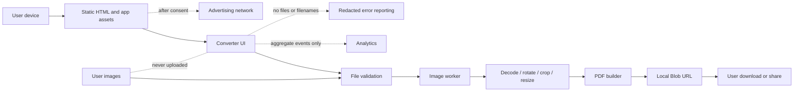
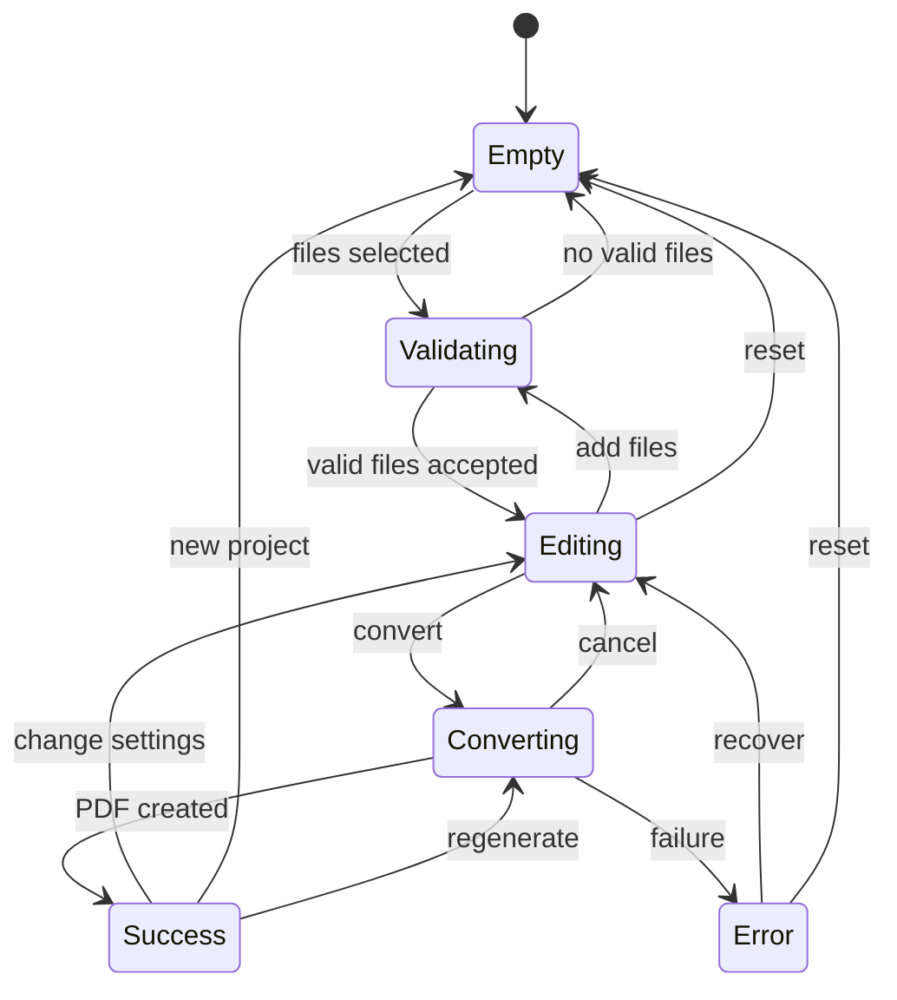

# LocalPDF — Product & Engineering Specification

> **Working title:** LocalPDF  
> **Product:** Free, privacy-first image-to-PDF web utility  
> **Document status:** Implementation-ready v1 specification  
> **Version:** 1.0  
> **Last updated:** 2026-07-21  
> **Primary launch constraint:** Up to 5 output pages per conversion, unlimited conversions  
> **Business model:** Advertising-funded, with optional future B2B/API revenue  
> **Privacy model:** Files are processed locally in the browser and are never uploaded

---

## 1. Executive Summary

LocalPDF is a fast, mobile-first web application that converts images into a downloadable PDF without requiring an account, watermarking the output, or uploading user files to a server.

The product's primary differentiator is not merely “image to PDF.” It is:

> **Convert images to PDF privately. Your files never leave your device. No signup. No watermark.**

The launch product supports up to five output pages per conversion. This limit must be controlled by configuration rather than hard-coded so that 3-, 5-, 10-, and 20-page variants can be tested. Users may perform unlimited conversions. The application must clearly communicate the limit before file selection and must never surprise users after they finish editing.

The site is designed as the first tool in a larger privacy-first document utility platform. It must be useful enough to earn organic links, fast enough to compete with established converter sites, and safe enough to monetize without placing advertisements near upload, convert, or download controls.

### 1.1 Product principles

1. **Private by default:** Images never leave the device.
2. **No account friction:** The core workflow requires no signup, email, or payment.
3. **No deceptive limitations:** Limits are visible before users start.
4. **Fast on ordinary phones:** Mobile performance is a first-class requirement.
5. **Accessible by default:** The target is WCAG 2.2 Level AA.
6. **Ads must not compromise trust:** Monetization is physically and visually separated from task controls.
7. **Search pages must be genuinely useful:** No mass-produced doorway pages.
8. **Progressive enhancement:** The core flow works in every supported browser; advanced acceleration is optional.
9. **User content is never analytics data:** Never record filenames, image contents, OCR text, or PDF contents.
10. **Configuration over rewrites:** Limits, features, ads, and experiments are controlled remotely or at build time.

---

## 2. Problem and Opportunity

People routinely need to combine screenshots, photographed documents, receipts, homework, identification documents, chat images, and scanned pages into a PDF. Existing products often introduce one or more forms of friction:

- Mandatory uploads to an unknown server
- Account creation before download
- Watermarks
- Aggressive advertising or misleading download buttons
- Poor mobile usability
- Unexpected limits after files have already been selected
- Slow conversions caused by upload and download round trips
- Confusing page size and image-fitting settings
- Weak accessibility

A browser-only implementation removes upload latency, materially reduces infrastructure cost, and creates a credible privacy promise. The challenge is distribution, not conversion technology. Therefore, the product must combine excellent utility UX with original supporting content, useful adjacent tools, strong performance, and conservative ad placement.

---

## 3. Goals, Non-Goals, and Constraints

## 3.1 Goals

### Product goals

- Convert 1–5 supported images into a valid PDF in one simple session.
- Complete the common workflow in under one minute without instructions.
- Support drag-and-drop, file selection, clipboard paste, and mobile camera/gallery input where available.
- Provide page ordering, rotation, removal, page size, orientation, margins, fit mode, and output quality controls.
- Process all user files locally.
- Produce a PDF that opens correctly in major browser viewers, macOS Preview, Windows viewers, Adobe Acrobat Reader, Android viewers, and iOS Files/Preview.
- Provide clear errors and safe recovery when files are unsupported or device memory is insufficient.
- Be installable as a Progressive Web App where supported.
- Be indexable and understandable by search engines without requiring the app JavaScript.
- Support ad monetization while minimizing accidental-click and policy risk.

### Business goals

- Reach an initial organic conversion rate of at least 35% from tool-page visit to successful PDF generation.
- Reach a successful download rate of at least 90% among completed conversions.
- Establish a reusable architecture for additional browser-only utilities.
- Keep processing infrastructure cost close to zero for the core workflow.
- Create sufficient original publisher content to support ad-network review and organic discovery.
- Validate whether users prefer a 5-page limit or a larger free allowance.

## 3.2 Non-goals for v1

- Editing existing PDFs
- OCR or searchable PDF generation
- Password-protected or encrypted PDFs
- Digital signatures
- Cloud storage or sharing links
- User accounts
- Server-side file processing
- Batch conversion above the configured page limit
- Multi-document projects
- TIFF, animated GIF, RAW camera formats, SVG, EPS, PSD, or AI input
- Lossless preservation of all image metadata
- Exact archival conformance such as PDF/A
- Guaranteed legal-document compliance
- Native Android or iOS applications

## 3.3 Hard constraints

- No image or generated PDF may be transmitted to application servers.
- No filenames may be sent to analytics, logging, advertising, or error-reporting systems.
- The default v1 limit is five pages per conversion.
- The page limit must be visible before selection.
- There is no daily conversion limit.
- There is no watermark.
- The primary conversion path must work without an account.
- Ads must not appear inside the tool workspace or next to primary action buttons.
- User-selected files must not be cached by the service worker.

---

## 4. Audience and Jobs to Be Done

## 4.1 Primary users

### Mobile document sender

Needs to photograph or select several pages and send them as one PDF through email, a form, or a messaging app.

**Success condition:** Produces a correctly ordered PDF from a phone without installing an app.

### Student

Needs to combine homework photos, notes, diagrams, or screenshots into a single submission.

**Success condition:** Produces a readable PDF below a reasonable file size.

### Office and administrative user

Needs to combine receipts, signed forms, invoices, IDs, or screenshots into a standardized PDF.

**Success condition:** Uses A4 or Letter formatting, appropriate margins, and a professional filename.

### Privacy-conscious user

Does not want sensitive images uploaded to a third-party service.

**Success condition:** Can verify from the product UX and technical behavior that processing is local.

### Low-bandwidth user

Has slow or expensive connectivity.

**Success condition:** Can convert after the app shell loads without uploading large files.

## 4.2 Jobs to be done

- “When I have several images, help me combine them into one PDF so I can submit or share them.”
- “When my images have different orientations, help me rotate and order them correctly.”
- “When the PDF is too large, help me reduce its size without making text unreadable.”
- “When the images contain private information, let me convert them without uploading them.”
- “When I am on a phone, make the workflow obvious and touch-friendly.”
- “When one file is unsupported, explain exactly what I can do next.”

---

## 5. Positioning and Product Promise

## 5.1 Primary positioning

**Private image-to-PDF converter that works entirely in your browser.**

## 5.2 Core promises

- Files stay on your device.
- No signup.
- No watermark.
- Free for up to five pages per conversion.
- Works on mobile and desktop.
- Supports common image formats.
- Lets users reorder and rotate pages before download.

## 5.3 Trust language

Recommended primary trust message:

> **Private by design**  
> Your images are converted inside your browser. They are not uploaded to our servers.

Recommended technical disclosure:

> LocalPDF uses browser APIs to read and process files on your device. Closing or refreshing the page clears the current project. Analytics never receives filenames or file contents.

Do not claim “100% secure,” “military-grade,” “anonymous,” or “zero data collection.” Those claims are too broad when advertising, analytics, hosting logs, or consent systems may still collect ordinary website data.

---

## 6. Success Metrics

## 6.1 North-star metric

**Successful PDF downloads per 1,000 qualified tool visits.**

A qualified tool visit is a human session that loads the tool, is not identified as a bot, and remains for at least five seconds or interacts with the page.

## 6.2 Product funnel

1. Tool page viewed
2. File selection started
3. At least one valid image accepted
4. Editor ready
5. Conversion started
6. Conversion completed
7. PDF downloaded
8. Repeat conversion within 30 days

## 6.3 Initial targets

| Metric | Launch target | Healthy target |
|---|---:|---:|
| Visitor → valid file selection | 45% | 60% |
| Valid selection → conversion start | 75% | 85% |
| Conversion start → success | 95% | 98% |
| Conversion success → download | 90% | 96% |
| Overall qualified visit → download | 29% | 47% |
| Conversion error rate | < 5% | < 2% |
| Unsupported-file rate | < 8% | < 4% |
| Repeat-user rate, 30 days | 8% | 15% |
| p75 LCP | ≤ 2.5 s | ≤ 2.0 s |
| p75 INP | ≤ 200 ms | ≤ 150 ms |
| p75 CLS | ≤ 0.10 | ≤ 0.05 |

## 6.4 Guardrail metrics

- Accidental ad-click indicators
- Ad-policy warnings
- Consent rejection rate
- Bounce rate before tool interaction
- Memory-related crashes
- Download failures
- Rage clicks on disabled controls
- Page-limit abandonment
- Customer-support complaints about privacy or misleading UI
- Search-console indexing warnings
- Organic landing pages with little engagement

---

## 7. Scope and Phasing

## 7.1 MVP / P0

- JPG/JPEG, PNG, and WebP input
- Up to five pages per job
- Drag-and-drop and file picker
- Mobile camera/gallery input
- Thumbnail preview
- Reorder pages
- Rotate pages in 90-degree increments
- Remove page
- A4, US Letter, and “Fit to image” page sizes
- Auto, portrait, and landscape orientation
- Contain and cover fit modes
- Small, medium, large, and custom margins
- Original, balanced, and small-file output presets
- PDF generation in the browser
- Progress, cancel, error, success, and download states
- Privacy notice
- Responsive layout
- Keyboard support
- WCAG 2.2 AA implementation target
- Basic SEO pages and structured data
- Consent platform and conservative ad placements
- Privacy-safe analytics
- PWA app shell
- English launch

## 7.2 P1

- HEIC/HEIF input through lazy-loaded WASM decoder
- Crop editor
- Per-page orientation override
- Custom page dimensions
- DPI and JPEG quality advanced controls
- Page background color
- Paste from clipboard
- Share/download integration on compatible mobile devices
- Offline conversion after first visit
- Additional languages
- Image compressor, resizer, and HEIC converter as adjacent tools
- Browser-extension launch shortcut
- User-feedback widget

## 7.3 P2

- OCR and searchable PDF
- Password-protected PDF
- Page numbers and watermarks
- PDF metadata editor
- Scan cleanup: contrast, grayscale, threshold, shadow reduction
- Automatic page-edge detection and perspective correction
- Multi-frame TIFF support
- PDF merge/split/rotate tools
- API and white-label offering using an isolated server-side product
- Optional account for saved presets only
- Team or business plan

---

## 8. Product Rules

## 8.1 Page-limit policy

- `MAX_PAGES_PER_JOB` defaults to `5`.
- The accepted configuration range is `3–25`.
- Each accepted input image produces one PDF page in v1.
- Duplicating a page counts toward the limit.
- Invalid or rejected files do not count toward the limit.
- Users may run unlimited jobs.
- The interface must state the current limit before the user selects files.
- When more than the limit is selected, accept the first valid files only after obtaining explicit user confirmation, or allow the user to choose which files to keep.
- Never process all files and reveal the limit only at download time.
- The limit should be A/B-testable by geography, device class, acquisition source, or experiment assignment.

## 8.2 Size and dimension limits

Recommended defaults:

```yaml
MAX_PAGES_PER_JOB: 5
MAX_FILE_BYTES: 25_000_000
MAX_TOTAL_INPUT_BYTES: 100_000_000
MAX_SOURCE_PIXELS_PER_IMAGE: 60_000_000
MAX_OUTPUT_PDF_BYTES_SOFT: 40_000_000
MAX_OUTPUT_PDF_BYTES_HARD: 100_000_000
MAX_CUSTOM_PAGE_MM: 1000
MIN_CUSTOM_PAGE_MM: 10
```

The total input-byte limit is a safety guard, not a business limit. The app may lower memory-heavy limits on constrained devices after a capability check, but must explain this before conversion.

## 8.3 Supported input formats

### Required in P0

- JPEG/JPG
- PNG
- WebP

### P1

- HEIC/HEIF
- BMP

### Explicitly rejected in v1

- SVG, because active content and external resource references complicate security
- Animated GIF, unless only the first frame is intentionally supported and disclosed
- TIFF
- RAW camera formats
- PSD
- Existing PDFs

Extension alone is not trusted. Files must be validated by MIME type and magic bytes where practical.

---

## 9. User Experience Specification

## 9.1 Page anatomy

Recommended desktop order:

1. Header with logo, tool navigation, language, theme
2. H1 and one-sentence value proposition
3. Compact privacy badge
4. Tool workspace
5. A clearly separated ad slot or sponsor unit
6. “How it works” content
7. Feature and privacy explanation
8. Use-case content
9. FAQ
10. Related tools
11. Footer with legal, privacy, contact, and consent settings

Recommended mobile order:

1. Compact header
2. H1 and trust message
3. Tool workspace
4. Supporting instructions
5. Clearly separated ad slot
6. FAQ and related tools
7. Footer

The tool must appear early. Do not force the user to scroll through an advertisement before reaching the upload action.

## 9.2 Tool states

### State A — Empty

Display:

- Drop zone / select button
- “Choose up to 5 images”
- Accepted formats
- “Your files stay on this device”
- Optional camera input on mobile
- Link to privacy explanation

Primary action label:

> Choose images

Secondary actions where available:

- Take photos
- Paste image

### State B — Reading files

- Show an indeterminate progress state if validation takes longer than 300 ms.
- Disable duplicate submission.
- Announce status through `aria-live="polite"`.

### State C — Editor

The editor includes:

- Reorderable page cards
- Page number
- Thumbnail
- Source format and human-readable size
- Rotate left/right
- Remove
- Crop, when enabled
- Error badge for any page that cannot be decoded
- Global output settings
- Estimated output size range, when reliable
- Convert button

The page card must support keyboard reordering. Dragging cannot be the only method.

### State D — Converting

Display:

- Overall progress bar
- Current stage: decoding, optimizing, building PDF, finishing
- Current page count, e.g. “Processing page 3 of 5”
- Cancel button
- Privacy reminder

Disable changes to the project while conversion is active, or snapshot the project and make that behavior clear.

### State E — Success

Display:

- Success confirmation
- Output filename
- PDF size
- Page count
- Primary “Download PDF” button
- Secondary “Convert more images” button
- Optional native share action when supported
- Summary of output settings

Do not place an ad beside, above, or immediately below the download button. Provide a visually distinct content section between the primary download controls and any advertising.

### State F — Recoverable error

Examples:

- Unsupported format
- File too large
- Pixel dimensions too large
- Browser ran out of memory
- PDF exceeds hard output limit
- Image decode failed
- Download blocked

Each error must state:

1. What happened
2. Which file or stage was affected, without transmitting the filename
3. What the user can do
4. Whether other pages remain usable

### State G — Fatal capability error

Use only when the browser lacks a required baseline feature. Provide:

- A concise explanation
- Supported-browser guidance
- A link to troubleshooting
- No fake conversion fallback

## 9.3 File selection behavior

Accepted methods:

- Click/tap file picker
- Drag-and-drop
- Mobile image library
- Mobile camera capture
- Clipboard paste, when supported
- Web Share Target, future

Selection rules:

- Preserve the order supplied by the browser, but invite the user to verify it.
- Natural-sort filenames only when the user explicitly chooses “Sort by filename.”
- Do not automatically upload or convert.
- Validate all files and show one consolidated result.
- If a selection includes valid and invalid files, retain valid files and explain rejected items.
- If adding files would exceed the page limit, open a selection-limit dialog.

## 9.4 Reordering

- Mouse/touch drag handle
- Keyboard “Move earlier” and “Move later” buttons
- Optional multi-select in P1
- Smooth animation respecting `prefers-reduced-motion`
- Focus remains on the moved item after keyboard action
- Screen-reader announcement: “Page 3 moved to position 2 of 5.”

## 9.5 Image orientation

- Read EXIF orientation where present.
- Render the visual orientation correctly.
- Strip EXIF from processed output by default.
- Allow 90°, 180°, and 270° rotation.
- Store rotation non-destructively until PDF generation.

## 9.6 Crop editor, P1

- Aspect ratio options: free, page ratio, original
- Rotate from crop screen
- Reset
- Minimum crop area
- Keyboard-accessible numeric inputs as fallback
- Never permanently alter the source `File` object

## 9.7 Output settings

### Page size

- A4: 210 × 297 mm
- US Letter: 8.5 × 11 in
- US Legal, P1
- Fit to image
- Custom dimensions, P1

### Orientation

- Auto per page
- Portrait
- Landscape

In auto mode, choose the orientation that maximizes displayed image area after margins.

### Fit mode

- **Contain:** Whole image visible; empty space may remain.
- **Cover:** Page fully filled; image may be cropped.
- **Stretch:** P1 advanced option; distort image to fill page.
- **Original size:** P1; use image dimensions and selected DPI.

Default: `contain`.

### Margins

Preset labels:

- None: 0 mm
- Small: 5 mm
- Normal: 10 mm
- Large: 20 mm
- Custom: 0–50 mm per side, P1

Default: `normal` for office/document use, subject to usability testing. A separate “Full bleed” preset can set zero margins.

### Background

Default: white. PNG transparency must be composited over the selected page background. Transparent PDF image behavior may vary, so v1 uses an explicit background.

### Quality presets

#### Original

- Preserve source image dimensions unless safety limits require downscaling.
- JPEG quality approximately 0.92 when re-encoding is required.
- Suitable for print and archival-like sharing, but not formal archival compliance.

#### Balanced — default

- Target effective resolution: 150–200 DPI for fitted document images.
- JPEG quality approximately 0.82.
- Good text readability and moderate output size.

#### Small file

- Target effective resolution: 100–130 DPI.
- JPEG quality approximately 0.68.
- Show warning that fine text may become less readable.

Advanced custom controls are P1.

## 9.8 PDF filename

Default:

```text
images-to-pdf-YYYY-MM-DD.pdf
```

Optional filename field:

- Maximum 80 visible characters before extension
- Strip path separators and control characters
- Normalize whitespace
- Prevent hidden extension confusion
- Always append `.pdf`
- Do not send the chosen filename to analytics

## 9.9 Session behavior

- Current files live only in memory.
- Refreshing or closing the page clears the project.
- Warn before accidental navigation only when a non-empty project exists.
- Persist non-sensitive preferences such as page size, margins, theme, and quality in local storage.
- Do not persist raw image blobs by default.
- The service worker must not cache user files, generated blobs, or blob URLs.
- Revoke blob URLs after thumbnail removal, project reset, or download lifecycle completion.

---

## 10. Content and Copy Requirements

## 10.1 Above-the-fold copy

### H1

> Convert Images to PDF — Private and Free

### Subheading

> Combine up to five JPG, PNG, or WebP images into one PDF. No signup, no watermark, and no file uploads.

### Trust badge

> Processed on your device

### Limit text

> Free: up to 5 pages per conversion. Unlimited conversions.

## 10.2 Empty-state helper copy

> Select up to five images. You can reorder, rotate, and adjust the page layout before downloading your PDF.

## 10.3 Privacy copy

> Your images are processed locally by your browser. They are not sent to LocalPDF servers.

## 10.4 Limit dialog

Title:

> This conversion supports up to 5 pages

Body:

> You selected 8 valid images. Choose the 5 images you want to include, or start a separate conversion for the remaining images.

Actions:

- Choose pages
- Keep first 5
- Cancel

## 10.5 Success copy

> Your PDF is ready

> The file was created on this device and has not been uploaded.

## 10.6 Error-copy style

- Avoid error codes in the primary message.
- Use plain language.
- Never blame the user.
- Offer one most likely remedy first.
- Put diagnostic details in an expandable area.

---

## 11. Accessibility

Target: **WCAG 2.2 Level AA**.

## 11.1 Requirements

- All actions are keyboard accessible.
- Drag-and-drop has keyboard alternatives.
- Focus indicators meet contrast and visibility requirements.
- Touch targets are at least 44 × 44 CSS pixels where practical.
- Text and essential icons meet contrast requirements.
- Status messages use appropriate live regions.
- Errors are programmatically associated with controls.
- Form fields have visible labels, not placeholders alone.
- Reordering updates are announced.
- Modal focus is trapped and restored correctly.
- The app works at 200% zoom without loss of functionality.
- The layout reflows at 320 CSS pixels without horizontal scrolling, excluding intentional canvas previews.
- Motion respects `prefers-reduced-motion`.
- Color is not the only indicator of status.
- Thumbnails have functional alt text such as “Page 2 preview,” not speculative descriptions of image content.
- The app never performs OCR merely to create accessibility descriptions without explicit consent.

## 11.2 Screen-reader flow

1. Page title and value proposition
2. Privacy and limit disclosure
3. File selection control
4. Validation summary
5. Ordered page list
6. Output settings
7. Convert action
8. Progress status
9. Download action

## 11.3 Accessibility testing

- Automated checks with axe-core
- Keyboard-only manual pass
- VoiceOver + Safari
- NVDA + Firefox or Chrome
- TalkBack + Chrome on Android
- 200% and 400% zoom checks
- Reduced-motion mode
- High-contrast mode where available

Automated checks are necessary but insufficient.

---

## 12. Visual Design System

## 12.1 Design qualities

- Calm
- Trustworthy
- Lightweight
- Functional
- Non-deceptive
- Mobile-first

Avoid visual patterns associated with download spam: blinking arrows, multiple competing green buttons, fake progress, countdowns, misleading “Start” buttons, or ads styled like actions.

## 12.2 Suggested tokens

```css
:root {
  --space-1: 0.25rem;
  --space-2: 0.5rem;
  --space-3: 0.75rem;
  --space-4: 1rem;
  --space-6: 1.5rem;
  --space-8: 2rem;
  --space-12: 3rem;

  --radius-sm: 0.5rem;
  --radius-md: 0.75rem;
  --radius-lg: 1rem;

  --shadow-card: 0 1px 3px rgb(0 0 0 / 0.10), 0 8px 24px rgb(0 0 0 / 0.06);
  --content-max: 72rem;
  --reading-max: 46rem;
  --tool-max: 64rem;
}
```

Final colors must be validated for contrast in light and dark themes. Avoid encoding business logic around a specific color.

## 12.3 Component inventory

- AppHeader
- LanguageMenu
- ThemeToggle
- PrivacyBadge
- FileDropzone
- CameraInput
- ClipboardInput
- ValidationSummary
- PageList
- PageCard
- SortMenu
- OutputSettingsPanel
- QualityPresetControl
- AdvancedSettingsDisclosure
- ConvertButton
- ConversionProgress
- SuccessPanel
- DownloadButton
- ShareButton
- ErrorSummary
- CapabilityWarning
- LimitDialog
- CropDialog
- ConsentSettingsLink
- AdSlot
- HowItWorks
- FAQ
- RelatedTools
- Footer

---

## 13. Advertising and Monetization

## 13.1 Monetization principles

- The tool remains usable when ads are blocked.
- Ads never imitate buttons, notifications, file rows, progress indicators, or downloads.
- Ads are never placed inside the workspace.
- Ads are separated from interactive controls by content and clear visual boundaries.
- Ad space is reserved to prevent layout shift.
- Ads load only after applicable consent signals.
- Page experience takes priority over maximum ad density.
- No forced interstitial before conversion or download.
- No countdown to unlock download.
- No pop-under or new-tab advertisements.
- No purchased bot, incentivized, or misleading traffic.

## 13.2 Recommended ad inventory

### Slot A — Supporting-content slot

- Appears after the tool workspace and before the “How it works” section, or after a short explanatory paragraph.
- Clearly labeled “Advertisement.”
- Hidden while a modal is open.
- Reserved dimensions to avoid CLS.

### Slot B — Long-form content slot

- Appears between substantial original content sections on longer pages.
- Not on pages that lack sufficient publisher content.

### Slot C — Desktop rail, experimental

- Only on wide screens.
- Must not align visually with page-item action controls.
- Must not become sticky if it creates proximity to tool actions.
- Requires policy review and UX testing before enablement.

### Prohibited placements

- Inside the drop zone
- Between page cards
- Beside rotate/delete controls
- Between settings and Convert
- Adjacent to Convert
- Adjacent to Download
- In a success dialog
- Styled like a related tool or system message
- Above a label such as “Download” or “Continue”

## 13.3 Consent management

- Use a Google-certified consent management platform when required for Google advertising in the EEA, UK, and Switzerland.
- Respect consent mode and regional privacy requirements.
- Provide a persistent “Privacy choices” or “Consent settings” link.
- Do not initialize non-essential analytics or personalized advertising before valid consent where required.
- Support non-personalized or limited advertising paths where configured.
- Store consent records according to the selected CMP’s implementation requirements.

## 13.4 Revenue diversification

The core consumer tool remains free. Optional future revenue may include:

- Privacy-friendly sponsorships
- A paid API for businesses
- White-label deployment
- Team document workflows
- One-time support/tip contribution
- Browser-extension sponsorship
- Enterprise self-hosted build

Do not degrade the free product merely to manufacture upgrade pressure.

---

## 14. SEO and Organic Acquisition

## 14.1 Technical SEO

- Server-render or statically generate all indexable content.
- Use a canonical URL on every indexable page.
- Generate sitemap indexes where needed.
- Use descriptive titles and meta descriptions.
- Add Open Graph and social metadata.
- Use `SoftwareApplication` structured data where applicable.
- Add Organization/WebSite data when accurate.
- Keep interactive project state out of URLs unless intentionally shareable.
- Mark non-content state pages `noindex` if separate routes are used.
- Do not block required rendering assets.
- Use semantic headings and link text.
- Test structured data before release.
- Use `hreflang` for complete translations.

## 14.2 Content strategy

Every landing page must have a distinct user job and actual functionality. Suitable future pages include:

- JPG to PDF
- PNG to PDF
- WebP to PDF
- HEIC to PDF
- Screenshots to PDF
- Photos to PDF on iPhone
- Photos to PDF on Android
- Receipts to PDF
- Homework images to PDF
- ID front and back to PDF
- WhatsApp images to PDF
- Image compressor
- Image resizer
- HEIC to JPG
- Scan photos to PDF

A format page must not be a title-swapped clone. It should include:

- Relevant format handling
- Specific settings
- Real limitations
- Original examples or diagrams
- Troubleshooting
- Privacy explanation
- Device-specific instructions where applicable
- Internal links to genuinely related tools

## 14.3 Content quality rules

- No mass generation of near-duplicate keyword pages.
- No copied competitor instructions.
- No fake review scores.
- No invented user testimonials.
- No misleading “best” claims without evidence.
- No indexing empty tag or search pages.
- No AI-generated content published without editorial review and actual user value.
- Keep legal and privacy pages accurate and updated.

## 14.4 Link acquisition ideas

- Publish an open technical explanation of browser-only PDF generation.
- Offer an embeddable privacy badge linking to the tool.
- Release a small open-source image-to-PDF core library or benchmark.
- Publish useful document-submission guides for schools and small businesses.
- Build localized tools with genuinely complete translations.
- Create a no-upload utility directory.
- Partner with privacy, education, and remote-work communities without paying for deceptive links.

---

## 15. Technical Architecture

## 15.1 Recommended stack

Use current stable releases at implementation time.

- **Framework:** Next.js with TypeScript
- **Rendering:** Static generation for content; client component for the converter
- **UI:** React with a lightweight component layer and CSS variables or utility CSS
- **PDF generation:** `pdf-lib` or an equivalently audited client-side library
- **Image decode:** Browser-native decoding first
- **Image processing:** Canvas / OffscreenCanvas
- **Concurrency:** Web Worker for decode, resize, and encoding
- **HEIC P1:** Lazy-loaded libheif-based WASM decoder
- **State:** Local reducer/state machine; no global state library required initially
- **Content:** MDX or typed content files
- **PWA:** Service worker caching the app shell only
- **Hosting:** Static/edge platform with global CDN
- **Analytics:** Privacy-minimized event analytics plus Web Vitals RUM
- **Error reporting:** Redacted client-error capture with strict denylist
- **Testing:** Vitest/Jest, Testing Library, Playwright, axe-core
- **CI/CD:** GitHub Actions or equivalent

Do not couple the product to a specific vendor when a standard static deployment is sufficient.

## 15.2 High-level architecture



## 15.3 Processing model

The conversion pipeline should be incremental to reduce peak memory:

1. Validate file metadata and magic bytes.
2. Read dimensions without fully decoding when possible.
3. Generate low-resolution thumbnails.
4. Store edit instructions, not edited image copies.
5. On conversion, process one page at a time.
6. Decode source.
7. Apply orientation and crop.
8. Downscale based on output target.
9. Composite transparency onto background.
10. Encode as JPEG or PNG based on content and preset.
11. Embed into PDF.
12. Release intermediate buffers before processing the next page.
13. Serialize PDF.
14. Create a Blob URL.
15. Trigger user-controlled download.
16. Revoke prior Blob URL when replaced or reset.

## 15.4 Threading

Preferred:

- Main thread: UI, settings, focus, progress
- Worker: decoding, transformations, resizing, encoding
- Main or worker: PDF assembly depending on library support and browser stability

Fallback:

- Use chunked main-thread work with yielding when OffscreenCanvas or transferable image objects are unavailable.
- Maintain responsive input and visible progress.

Do not require cross-origin isolation in v1 because advertising scripts and third-party consent components may complicate it. Prefer single-threaded WASM where necessary.

## 15.5 Browser support

Define support by capabilities, not only version numbers.

Baseline requirements:

- File and Blob APIs
- Promise and async functions
- Canvas 2D
- Object URLs
- Typed arrays
- Web Workers, preferred but not strictly required

Tier A:

- Current and previous two stable major versions of Chrome, Edge, Firefox, and Safari
- Current major iOS Safari
- Current major Android Chrome

Tier B:

- Older browsers with baseline APIs, using reduced performance or fewer features

Unsupported:

- Internet Explorer
- Embedded browsers missing reliable file download or canvas support

Show a capability warning rather than blocking solely based on user agent.

## 15.6 Suggested repository structure

```text
/apps/web
  /app
    /(marketing)
    /tools/image-to-pdf
    /privacy
    /terms
    /about
  /components
    /tool
    /content
    /ads
    /consent
  /features/image-to-pdf
    /components
    /domain
    /processing
    /workers
    /validation
    /analytics
    /tests
  /content
  /lib
  /public
  /styles
/packages
  /pdf-core
  /image-core
  /ui
  /config
  /analytics-schema
```

For an initial small team, a single app repository is acceptable. Extract packages only when reuse is real.

---

## 16. Domain Model

```ts
type SupportedImageFormat = 'jpeg' | 'png' | 'webp' | 'heic' | 'bmp';

type PageSizePreset = 'a4' | 'letter' | 'legal' | 'image' | 'custom';
type PageOrientation = 'auto' | 'portrait' | 'landscape';
type FitMode = 'contain' | 'cover' | 'stretch' | 'original';
type QualityPreset = 'original' | 'balanced' | 'small' | 'custom';

type CropRect = {
  x: number;      // normalized 0..1
  y: number;
  width: number;
  height: number;
};

type ProjectPage = {
  id: string;
  file: File;
  format: SupportedImageFormat;
  sourceWidth: number;
  sourceHeight: number;
  sourceBytes: number;
  exifOrientation?: number;
  rotationDegrees: 0 | 90 | 180 | 270;
  crop?: CropRect;
  thumbnailUrl: string;
  status: 'ready' | 'invalid' | 'processing' | 'error';
  localErrorCode?: string;
};

type PdfSettings = {
  pageSize: PageSizePreset;
  customWidthMm?: number;
  customHeightMm?: number;
  orientation: PageOrientation;
  fitMode: FitMode;
  marginsMm: { top: number; right: number; bottom: number; left: number };
  background: string;
  quality: QualityPreset;
  jpegQuality?: number;
  targetDpi?: number;
  stripMetadata: true;
};

type ConversionResult = {
  blob: Blob;
  objectUrl: string;
  bytes: number;
  pageCount: number;
  durationMs: number;
  warnings: string[];
};
```

The `File` and `Blob` objects must never be serialized into analytics payloads or logs.

---

## 17. State Machine



State transitions must be explicit and testable. Prevent double conversion and stale-worker messages by assigning every conversion attempt a unique job ID.

---

## 18. File Validation

## 18.1 Validation sequence

1. Confirm object is a `File` or supported Blob-like object.
2. Reject zero-byte file.
3. Check configured byte limit.
4. Inspect extension only as a user-facing hint.
5. Inspect MIME type.
6. Inspect magic bytes where supported.
7. Decode dimensions safely.
8. Reject dimensions outside limits.
9. Detect unsupported animation/multiple frames where applicable.
10. Generate thumbnail.
11. Record only non-sensitive aggregate attributes.

## 18.2 Error codes

```text
EMPTY_FILE
TOO_MANY_FILES
FILE_TOO_LARGE
TOTAL_INPUT_TOO_LARGE
UNSUPPORTED_MIME
SIGNATURE_MISMATCH
DECODE_FAILED
PIXEL_LIMIT_EXCEEDED
ANIMATED_FORMAT_UNSUPPORTED
MEMORY_CONSTRAINT
HEIC_DECODER_UNAVAILABLE
```

User-facing copy is localized and must not expose internal stack traces.

## 18.3 Malicious and pathological inputs

Test and guard against:

- Image decompression bombs
- Tiny compressed file with enormous declared dimensions
- Corrupted metadata
- Incorrect MIME type
- Double extensions
- HTML renamed as `.jpg`
- SVG renamed as `.png`
- Truncated JPEG
- Malformed EXIF
- Extreme ICC profiles
- Transparent PNGs
- Very wide or tall images
- Unicode and control characters in names
- Duplicate files

---

## 19. Image and PDF Processing

## 19.1 Coordinate systems

Use PDF points:

```text
1 inch = 72 points
1 mm = 72 / 25.4 points
```

For a page of width `Pw`, height `Ph`, and margins `Ml`, `Mr`, `Mt`, `Mb`:

```text
Aw = Pw - Ml - Mr
Ah = Ph - Mt - Mb
```

For an image of width `Iw` and height `Ih`:

### Contain

```text
scale = min(Aw / Iw, Ah / Ih)
Rw = Iw * scale
Rh = Ih * scale
x = Ml + (Aw - Rw) / 2
y = Mb + (Ah - Rh) / 2
```

### Cover

```text
scale = max(Aw / Iw, Ah / Ih)
```

Crop the overflow symmetrically unless a user crop/focal point is supplied.

## 19.2 Auto orientation

For portrait and landscape candidate pages, calculate the contain scale and choose the candidate with the greater rendered image area. Preserve user override.

## 19.3 Effective resolution

For a rendered width in inches:

```text
effectiveDpi = outputImagePixelWidth / renderedWidthInches
```

Downscale sources that substantially exceed the target DPI. Avoid upscaling unless required for a transformation pipeline; upscaling does not create detail.

## 19.4 Encoding selection

- JPEG source without transparency may be embedded directly only when no rotation, crop, resize, metadata stripping, or color transformation is required and library behavior is safe.
- Otherwise re-render through canvas.
- PNG with line art may remain PNG if output size is acceptable.
- Photographic or oversized images should generally be JPEG-encoded according to quality preset.
- Alpha must be composited over the selected background for predictable output.

## 19.5 Metadata

- Strip EXIF and GPS by default through decode/re-encode.
- Do not copy source comments or profiles unless required for color fidelity and proven safe.
- Set minimal PDF metadata:
  - Producer: LocalPDF
  - Creator: LocalPDF web app
  - Creation date: current local time or omitted based on privacy decision
- Do not set PDF title from source filenames by default.

## 19.6 Cancellation

- Conversion uses an `AbortController`-like abstraction.
- Worker checks cancellation between pages and expensive stages.
- On cancel, release buffers and restore the editor.
- Do not emit a conversion-error event for user cancellation.

## 19.7 Memory strategy

- Generate thumbnails at a maximum dimension of 512 px.
- Process full-resolution pages sequentially.
- Transfer rather than clone buffers when supported.
- Close `ImageBitmap` objects after use.
- Null references to intermediate canvases.
- Avoid retaining multiple full-size encodings.
- Detect probable memory pressure and recommend the small-file preset or fewer pages.

---

## 20. Performance Budgets

## 20.1 Web-vitals targets

At the 75th percentile:

- LCP ≤ 2.5 seconds
- INP ≤ 200 milliseconds
- CLS ≤ 0.10

Internal preferred targets are stricter where practical.

## 20.2 Asset budgets

Suggested launch budgets, excluding third-party ad and consent scripts:

| Asset | Budget |
|---|---:|
| Initial JS, gzipped | ≤ 180 KB |
| Initial CSS, gzipped | ≤ 35 KB |
| Initial critical fonts | ≤ 100 KB, preferably system fonts |
| Initial page transfer | ≤ 450 KB |
| Converter lazy chunk | ≤ 350 KB gzipped |
| HEIC decoder | Lazy only; ≤ 3 MB compressed preferred |
| Hero images | Avoid or ≤ 100 KB total |

## 20.3 Runtime targets

Reference workload: five 12-megapixel JPEG images, balanced preset.

- Editor thumbnails ready in ≤ 3 seconds on a representative mid-range mobile device.
- Conversion completes in ≤ 10 seconds on a representative mid-range mobile device.
- Main thread should not contain tasks longer than 100 ms during editing.
- Reordering response should feel immediate, with visual update within one animation frame.
- Progress must begin within 300 ms after conversion starts.

These are product targets, not user-facing guarantees.

## 20.4 Ad-performance controls

- Reserve ad dimensions.
- Lazy-load below-the-fold ads.
- Do not let ad scripts block the tool bundle.
- Monitor web-vital differences by ad-enabled status and consent status.
- Disable or reduce a placement automatically if it causes unacceptable CLS or INP regression.

---

## 21. PWA and Offline Behavior

## 21.1 Installability

- Web app manifest
- Icons and maskable icons
- Standalone display mode
- Theme and background colors
- Descriptive app name and short name
- Start URL without user project data

## 21.2 Service worker

Cache:

- Static HTML shell
- Versioned JS/CSS
- Local icons
- Offline help page
- Necessary local fonts

Never cache:

- User-selected files
- Blob URLs
- Generated PDFs
- Analytics requests
- Ad responses
- Consent responses unless the provider manages them

## 21.3 Offline mode

After first successful load:

- JPG/PNG/WebP conversion should work offline.
- HEIC works offline only if its decoder was previously cached and license terms permit caching.
- Ads and analytics silently fail offline.
- The UI displays “Offline — conversion still works on this device.”

---

## 22. Privacy and Legal Requirements

## 22.1 Data inventory

### User content

- Source images: browser memory only
- Generated PDF: browser memory only until downloaded
- Filenames: local UI only
- Edit instructions: local memory; preferences may persist without filenames

### Operational data

Potentially collected:

- IP address in ordinary hosting/CDN logs
- Browser and device information
- Referrer and page URL
- Consent state
- Aggregate product events
- Error codes without content
- Advertising identifiers where permitted and consented

## 22.2 Privacy-policy disclosures

The privacy policy must accurately explain:

- Files are processed locally and not uploaded by the converter.
- The website host/CDN may receive ordinary request metadata.
- Analytics provider and event categories.
- Advertising partners and consent controls.
- Cookies/local storage used.
- Retention periods.
- User rights and contact method.
- International transfers where relevant.
- Children/minors position, if applicable.

## 22.3 Legal pages

Required before monetized launch:

- Privacy Policy
- Terms of Use
- Cookie/Tracking disclosure
- Contact page
- Copyright/takedown procedure
- Advertising disclosure
- Consent settings access

Legal text must be reviewed for the operating entity and jurisdictions. This specification is not legal advice.

## 22.4 Local-storage keys

Namespace all keys:

```text
localpdf.preferences.v1
localpdf.consent-mirror.v1     # only when technically required
localpdf.experiments.v1
```

Do not store file names, image hashes, image dimensions linked to persistent IDs, or generated document data.

---

## 23. Security

## 23.1 Threat model

Primary threats:

- Malicious image files
- Memory exhaustion
- Dependency compromise
- Cross-site scripting through filenames or content pages
- Clickjacking
- Ad-script compromise or misleading creatives
- Consent misconfiguration
- Analytics leakage
- Blob URL lifecycle errors
- Supply-chain vulnerabilities
- Service-worker cache poisoning
- Spam or bot traffic causing invalid-ad activity

## 23.2 Controls

- Strict dependency lockfile and reproducible builds
- Automated dependency and license scanning
- Content Security Policy tuned for required ad/CMP providers
- `frame-ancestors 'none'` or equivalent unless embedding is intentional
- `X-Content-Type-Options: nosniff`
- Strict referrer policy
- Permissions Policy disabling unnecessary capabilities
- Escape all filenames and user-provided strings
- No HTML rendering from file metadata
- Magic-byte validation
- Pixel and byte limits
- Worker isolation for heavy processing
- No `eval` in first-party code
- Signed deployment artifacts where supported
- Branch protection and required review
- Secret scanning
- Subresource integrity for stable third-party scripts where technically supported
- Minimal third-party scripts
- Regular ad-creative and placement review

## 23.3 Content Security Policy considerations

Advertising networks often require broad script, frame, and connection allowances. Keep the converter on the same origin but isolate third-party code architecturally:

- Maintain a documented allowlist.
- Avoid wildcard origins where possible.
- Deploy CSP initially in report-only mode.
- Move to enforcement after validating ads, consent, analytics, and error reporting.
- Never weaken `script-src` merely to silence an unknown error.

## 23.4 Security headers

Recommended starting point, adjusted for actual integrations:

```text
X-Content-Type-Options: nosniff
Referrer-Policy: strict-origin-when-cross-origin
Permissions-Policy: camera=(self), microphone=(), geolocation=(), payment=()
Cross-Origin-Opener-Policy: same-origin-allow-popups
```

Do not enable headers that break download, share, consent, or ad functionality without testing.

---

## 24. Analytics

## 24.1 Principles

- Collect only what is needed to improve reliability, acquisition, and conversion.
- Never collect filenames, file contents, image previews, OCR text, document titles, or PDF data.
- Bucket numeric values.
- Avoid stable user identifiers unless necessary and consented.
- Separate product analytics from advertising measurement.
- Document every event and property.

## 24.2 Event schema

### Page and acquisition

```text
tool_viewed
privacy_details_opened
limit_details_opened
related_tool_clicked
```

### File workflow

```text
file_picker_opened
files_selected
files_validation_completed
page_added
page_removed
page_reordered
page_rotated
crop_applied
```

### Settings

```text
page_size_changed
orientation_changed
fit_mode_changed
margin_changed
quality_changed
advanced_settings_opened
```

### Conversion

```text
conversion_started
conversion_cancelled
conversion_completed
conversion_failed
download_started
share_started
new_project_started
```

### Allowed properties

- Page-count bucket: `1`, `2`, `3`, `4`, `5`, `6+`
- Total-input-size bucket
- Largest-image-pixel bucket
- Format set: generalized, e.g. `jpeg_only`, `mixed`, `webp_only`
- Device class
- Browser family and major version, if provider supports privacy-safe reporting
- Quality preset
- Page-size preset
- Duration bucket
- Output-size bucket
- Error code
- Experiment assignment
- Acquisition channel

### Forbidden properties

- Filename
- Full user-agent string when unnecessary
- Image hash
- File path
- Blob URL
- Source or output bytes as an exact value linked to an identifier
- Free-form exception text containing user data
- Clipboard contents

## 24.3 Web-vitals monitoring

Collect LCP, INP, CLS, TTFB, and conversion runtime by:

- Device class
- Country/region at coarse level, where permitted
- Ad-enabled/disabled state
- Consent state category
- Release version

Do not expose a user's file data in performance traces.

---

## 25. Error Reporting and Observability

## 25.1 Client errors

Before sending an error:

- Remove filenames
- Remove local paths
- Remove Blob URLs
- Remove object dumps containing `File`, `Blob`, `ArrayBuffer`, canvas, or image data
- Map known processing exceptions to stable codes
- Truncate unknown messages

## 25.2 Dashboards

Minimum dashboards:

1. Product funnel
2. Conversion success and failure by browser
3. Performance and Core Web Vitals
4. Page-limit abandonment
5. Format support errors
6. Ad performance and page-experience guardrails
7. Organic landing-page quality
8. Release health
9. Consent rates
10. Invalid-traffic indicators

## 25.3 Alerts

- Conversion failure rate exceeds 5% for 15 minutes
- Download failure exceeds 3%
- JavaScript error rate doubles over baseline
- LCP or CLS materially regresses after deployment
- A browser-specific failure rises above threshold
- Ad policy or consent warning is detected
- Static asset error rate exceeds threshold
- Service-worker update loop detected

---

## 26. Feature Flags and Configuration

```ts
type PublicConfig = {
  maxPagesPerJob: number;
  maxFileBytes: number;
  maxTotalInputBytes: number;
  maxSourcePixels: number;
  enableHeic: boolean;
  enableCrop: boolean;
  enableClipboard: boolean;
  enablePwa: boolean;
  enableNativeShare: boolean;
  enableAds: boolean;
  adPlacements: Array<'content_1' | 'content_2' | 'desktop_rail'>;
  enableAnalytics: boolean;
  defaultQuality: 'original' | 'balanced' | 'small';
  defaultPageSize: 'a4' | 'letter' | 'image';
  locale: string;
  experimentAssignments: Record<string, string>;
};
```

Rules:

- Public config contains no secrets.
- Invalid config falls back to safe defaults.
- Page-limit changes are logged by release/experiment.
- Ads can be disabled globally without redeploying if the platform supports safe remote config.
- Any remote config must be signed or served from a trusted same-origin endpoint.

---

## 27. Optional Backend

The core converter requires no application backend. Optional minimal endpoints may support:

- Feedback submission
- Public configuration
- Health status
- Experiment allocation
- Contact form
- Abuse-resistant anonymous counters

No endpoint may accept image or PDF payloads in the consumer product.

## 27.1 Example feedback endpoint

```http
POST /api/feedback
Content-Type: application/json
```

```json
{
  "rating": "positive",
  "category": "conversion_quality",
  "message": "Optional, max 1000 characters",
  "release": "2026.07.21.1",
  "locale": "en"
}
```

Controls:

- Rate limiting
- CAPTCHA only after suspicious behavior, not by default
- HTML escaping
- No attachments
- Clear notice not to include sensitive document information
- Retention policy

---

## 28. Localization

## 28.1 Localization architecture

- All UI strings use stable message keys.
- Support pluralization and variable order.
- Format dates and sizes by locale.
- Avoid concatenating translated fragments.
- Support right-to-left layout before launching an RTL locale.
- Localize metadata, structured data, and legal pages.
- Add `hreflang` only for complete, canonical translations.

## 28.2 Translation quality

- Human review for primary landing pages and core workflow.
- Validate terminology on actual devices.
- Do not launch a locale with only navigation translated.
- Error messages and consent flows require special review.

## 28.3 Suggested localization order

Select based on verified search demand and support capacity. A possible sequence:

1. English
2. Spanish
3. Portuguese
4. German
5. French
6. Italian
7. Polish
8. Turkish
9. Indonesian
10. Arabic or Hindi after RTL/font/performance readiness

This ordering is a hypothesis, not a substitute for keyword and market research.

---

## 29. Testing Strategy

## 29.1 Unit tests

- Page-size conversion
- Contain/cover geometry
- Orientation selection
- Margin calculations
- Filename sanitization
- MIME/signature validation
- Byte and pixel limits
- State transitions
- Analytics redaction
- Config validation
- Error mapping

## 29.2 Component tests

- Drop zone
- File-selection summary
- Limit dialog
- Keyboard reordering
- Rotation controls
- Settings panel
- Progress and cancellation
- Success/download panel
- Error recovery
- Consent-dependent ad rendering

## 29.3 Worker tests

- Decode and resize fixture images
- Rotation correctness
- Crop correctness
- Transparency compositing
- Cancellation
- Message ordering
- Stale-job rejection
- Memory cleanup signals

## 29.4 End-to-end tests

Critical paths:

1. One JPEG → default PDF → download
2. Five mixed supported images → reorder → rotate → convert
3. More than five files → limit resolution
4. Unsupported file mixed with valid images
5. Large image → downscale → convert
6. Transparent PNG → white background
7. Small-file preset
8. Cancel conversion
9. Retry after recoverable failure
10. Offline conversion after first load
11. Mobile viewport and camera-compatible input
12. Keyboard-only complete workflow
13. Consent accepted, rejected, and unavailable
14. Ads never appear in prohibited zones
15. Refresh with active project warning

## 29.5 PDF validation tests

For generated fixtures:

- Page count matches
- Page dimensions match preset
- Images maintain intended aspect ratio
- Rotation is correct
- Crop behavior is correct
- No blank pages
- File begins with valid PDF signature
- File opens in target viewers
- Output size remains within expected range
- Metadata contains no source filenames

Use a PDF parser in automated tests and a cross-viewer manual test matrix before major releases.

## 29.6 Browser/device matrix

Minimum manual matrix:

- Chrome on Windows
- Edge on Windows
- Firefox on Windows or Linux
- Safari on macOS
- Chrome on Android, mid-range device
- Safari on recent iPhone
- Safari on recent iPad

Add low-memory and older-device testing based on real traffic.

## 29.7 Performance tests

Fixture groups:

- Five ordinary phone photos
- Five 12–20 MP photos
- Five screenshots with text
- Five transparent PNGs
- Mixed portrait/landscape
- One file near byte limit
- Image near pixel limit
- Corrupted image

Track conversion time, peak memory where observable, long tasks, UI responsiveness, and output size.

## 29.8 Security tests

- Dependency scan
- Static analysis
- CSP report review
- XSS test through filenames
- Malformed image corpus
- Clickjacking test
- Service-worker cache inspection
- Analytics payload inspection
- Ad-placement manual review
- Consent-state verification

---

## 30. Acceptance Criteria

## 30.1 Core conversion

**Given** a user selects one to five valid JPG, PNG, or WebP images  
**When** the images pass validation and the user selects Convert  
**Then** the browser creates a valid PDF with one page per image and enables download without uploading the source images.

## 30.2 Page limit

**Given** the configured limit is five  
**When** a user selects more than five valid images  
**Then** the app clearly shows the limit and allows the user to choose no more than five before editing or conversion.

## 30.3 Privacy

**Given** a conversion session  
**When** the user selects, edits, converts, and downloads files  
**Then** network inspection shows no request containing source image bytes, generated PDF bytes, filenames, image previews, or Blob URLs.

## 30.4 Reordering

**Given** multiple pages in the editor  
**When** a user changes their order by drag or keyboard  
**Then** the preview order and generated PDF page order match.

## 30.5 Rotation

**Given** an image is rotated in the editor  
**When** the PDF is generated  
**Then** the page displays the image at the selected rotation without unintended stretching.

## 30.6 Accessibility

**Given** a keyboard-only user  
**When** they complete the conversion workflow  
**Then** every required action is available, focus is visible, reordering is possible, and status changes are announced.

## 30.7 Advertising safety

**Given** advertising is enabled  
**When** the user interacts with upload, edit, convert, and download actions  
**Then** no advertisement is inside the workspace, visually disguised as an action, or adjacent to the primary controls.

## 30.8 Error recovery

**Given** one selected file cannot be decoded  
**When** other selected images are valid  
**Then** the app identifies the failed item locally, retains the valid images, and allows the user to continue.

## 30.9 Offline mode

**Given** the PWA shell has previously loaded successfully  
**When** the user revisits without connectivity  
**Then** JPG/PNG/WebP conversion remains functional and the app does not display blocking network errors.

---

## 31. Launch Plan

## 31.1 Stage 0 — Internal prototype

- Basic local conversion
- Geometry and quality tests
- Memory profiling
- No ads
- No public indexing

Exit criteria:

- Five-page reference workload succeeds on target devices
- No file-content network requests
- Generated PDFs pass automated validation

## 31.2 Stage 1 — Private beta

- Complete editor
- Analytics redaction
- Accessibility pass
- English content
- Legal drafts
- PWA shell
- Ad placeholders only

Exit criteria:

- Conversion success ≥ 95%
- No critical accessibility blockers
- No high-severity security findings

## 31.3 Stage 2 — Public beta

- Index selected pages
- Enable consent platform
- Enable one conservative ad slot for a small traffic percentage
- Monitor performance and policy risk
- Collect user feedback

Exit criteria:

- Stable funnel for two weeks
- p75 web vitals within target
- No privacy leakage
- No ad-policy warnings

## 31.4 Stage 3 — General availability

- Full English launch
- Two conservative ad slots only on sufficiently content-rich pages
- Search Console and structured data monitoring
- Begin adjacent-tool roadmap
- Begin page-limit experiment

## 31.5 Stage 4 — Growth

- Add HEIC
- Add localized experiences
- Add adjacent tools
- Publish original technical/content assets
- Test 5 vs 10 vs 20 page limit
- Explore direct sponsorship or API revenue

---

## 32. Experiment Plan

## 32.1 Free page limit

Variants:

- A: 5 pages
- B: 10 pages
- C: 20 pages

Primary outcome:

- Successful downloads per 1,000 qualified visits

Secondary outcomes:

- Conversion completion
- Repeat use
- Ad impressions per successful session
- Output size and memory failures
- User complaints
- Organic engagement

Guardrails:

- No material decline in conversion success
- No significant mobile crash increase
- No deceptive messaging

## 32.2 Default margins

- A: 10 mm
- B: 5 mm
- C: 0 mm

Measure regenerate rate, setting changes, and support complaints.

## 32.3 Tool-first vs explanation-first

Test only layouts that keep the tool easy to find. Do not test designs that force users to view or click ads before use.

## 32.4 Ad density

- A: One content ad
- B: Two content ads on long pages

Measure revenue per session against conversion, web vitals, bounce, repeat usage, and policy indicators. Do not optimize on click-through rate alone.

---

## 33. Operations and Runbooks

## 33.1 Failed release

- Automatically retain the previous deploy.
- Roll back when conversion errors or JS errors exceed thresholds.
- Invalidate only affected static assets.
- Publish status notice only if users are materially affected.

## 33.2 Broken PDF reports

Collect without requesting sensitive source files by default:

- Browser family/version
- Device class
- Input format set
- Page-count bucket
- Settings
- Stable error code
- Output-size bucket

Offer an explicit opt-in diagnostic upload only in a future support system with clear warnings and retention controls. It is not part of v1.

## 33.3 Ad-policy incident

- Disable affected placement via remote config.
- Preserve the converter.
- Capture screenshots across breakpoints.
- Review proximity to controls, labels, layout shifts, and creatives.
- Do not re-enable until reviewed.

## 33.4 Consent incident

- Disable personalized ads where required.
- Verify CMP configuration and region behavior.
- Record incident timeline.
- Review whether non-essential tags fired before consent.

## 33.5 Performance regression

- Compare by release, browser, and ad state.
- Disable latest optional feature or ad placement.
- Inspect lazy-loading and third-party scripts.
- Re-run reference fixtures on target devices.

---

## 34. Cost Model

The browser-only architecture keeps variable conversion costs close to zero. Main costs are:

- Domain and DNS
- Static hosting/CDN
- Analytics
- Error reporting
- Consent management
- Email/contact service
- Development and maintenance
- Content and localization
- Legal review
- Monitoring and testing devices

Avoid server-side image processing until a paid use case justifies storage, compute, security, and compliance overhead.

A cost dashboard should track:

- Hosting bandwidth per 1,000 visits
- Third-party service cost per 1,000 visits
- Ad revenue per 1,000 sessions
- Revenue per successful download
- Content cost per organic landing page
- Support cost per 10,000 conversions

---

## 35. Brand and Domain Requirements

A final brand should be:

- Easy to spell from audio
- Not tied only to JPG
- Suitable for a future utility suite
- Distinct from established PDF brands
- Free of trademark conflict after professional search
- Available in a credible domain extension
- Understandable internationally

Avoid names implying official Adobe affiliation, government approval, security certification, or unlimited functionality when a page limit exists.

---

## 36. Risks and Mitigations

| Risk | Impact | Mitigation |
|---|---|---|
| Highly competitive search results | High | Privacy positioning, exceptional UX, adjacent tools, localization, original content |
| Five-page limit reduces usefulness | High | Configurable limit, unlimited jobs, clear disclosure, controlled experiments |
| Low ad revenue per visitor | High | Organic distribution, low infrastructure cost, multiple useful tools, revenue diversification |
| Ad placement causes policy issue | High | Conservative zones, remote kill switch, manual review, no ads near actions |
| Mobile memory crashes | High | Sequential processing, pixel limits, worker pipeline, presets, capability checks |
| HEIC decoder weight | Medium | P1, lazy load, native decode first, cache only when safe |
| Browser inconsistencies | Medium | Capability detection, cross-browser fixtures, progressive enhancement |
| Privacy claim contradicted by analytics | High | Precise language, payload denylist, network tests, transparent policy |
| Thin SEO pages | High | Unique functionality and editorial standards, no scaled doorway content |
| Third-party scripts hurt performance | High | Minimal vendors, lazy loading, performance guardrails, reserved ad space |
| Malicious image input | High | Validation, pixel limits, worker isolation, library updates, fuzz fixtures |
| Dependency supply-chain compromise | High | Lockfiles, scanning, review, minimal dependencies, reproducible builds |
| Generated PDF incompatible | Medium | Parser tests and cross-viewer matrix |
| Users misinterpret “local” | Medium | Clear technical disclosure and network-verifiable behavior |

---

## 37. Product Backlog

## 37.1 Highest-value next tools

1. HEIC to JPG
2. Image compressor
3. Image resizer
4. PDF merge
5. PDF split
6. PDF rotate
7. Scan images to PDF
8. Receipt images to PDF
9. ID front-and-back PDF
10. Screenshots to PDF

Each tool must share:

- Privacy model
- File-validation core
- Design system
- Consent and ad rules
- Analytics schema
- Accessibility patterns
- PWA shell

## 37.2 Potential moat-building features

- Offline utility suite
- Open-source processing core
- Transparent privacy diagnostics showing zero file uploads
- Best-in-class mobile scanning UX
- Local-first batch pipeline
- Localized workflows for school, government, and business submission needs
- Embeddable converter SDK without file transfer
- Enterprise self-hosted edition

---

## 38. Definition of Done

A feature is done only when:

- Product behavior matches acceptance criteria.
- Unit, integration, and end-to-end tests pass.
- Keyboard and screen-reader behavior is reviewed.
- Analytics events are documented and privacy-reviewed.
- No file content or filenames appear in network payloads.
- Loading and runtime performance remain within budget.
- Error and empty states are complete.
- Localization keys exist.
- Mobile and desktop layouts are tested.
- Security implications are reviewed.
- Ad placement remains compliant and non-deceptive.
- Documentation and support content are updated.
- Rollback or feature-flag path exists for high-risk changes.

---

## 39. Implementation Checklist

### Product

- [ ] Finalize brand and domain
- [ ] Validate five-page limit with users
- [ ] Approve positioning and trust copy
- [ ] Define launch countries and languages
- [ ] Finalize quality presets

### Design

- [ ] Mobile and desktop wireframes
- [ ] Empty/editor/progress/success/error states
- [ ] Keyboard reordering design
- [ ] Ad-safe layout zones
- [ ] Light/dark theme
- [ ] Accessibility annotations

### Engineering

- [ ] File validation
- [ ] Thumbnail generation
- [ ] Worker pipeline
- [ ] PDF geometry
- [ ] Quality presets
- [ ] Cancellation
- [ ] Blob lifecycle cleanup
- [ ] PWA shell
- [ ] Config and feature flags
- [ ] Privacy-safe analytics
- [ ] Redacted errors

### Content and SEO

- [ ] Tool landing page
- [ ] How-it-works content
- [ ] Privacy explanation
- [ ] FAQ
- [ ] Structured data
- [ ] Sitemap and canonical tags
- [ ] Original related-tool pages

### Legal and monetization

- [ ] Privacy Policy
- [ ] Terms
- [ ] Cookie/consent implementation
- [ ] Certified CMP where required
- [ ] Ad-network review
- [ ] Placement kill switch
- [ ] Invalid-traffic monitoring

### Quality

- [ ] Cross-browser PDF fixtures
- [ ] Accessibility audit
- [ ] Performance audit
- [ ] Security review
- [ ] Network privacy test
- [ ] Ad proximity review
- [ ] Offline test
- [ ] Release rollback test

---

## 40. Open Decisions

The following should be resolved before visual design is finalized:

1. Final brand name and domain
2. Whether A4 or auto-region page size is the default
3. Whether five pages is a permanent policy or launch experiment
4. Maximum input bytes on low-memory devices
5. Whether “Fit to image” is a P0 page-size option
6. Whether PNG line art remains PNG in balanced mode
7. Analytics provider
8. Consent platform
9. Advertising network and initial slot count
10. Hosting platform
11. Whether dark mode is launch scope
12. Whether the app stores preferences before consent under applicable law
13. Initial localization markets
14. Contact/support channel
15. Whether PDF creation date is included or omitted for privacy

Recommended product decision: launch with five pages because it matches the original concept, but prepare a 10- and 20-page experiment immediately. A larger free allowance is likely to improve utility and organic recommendation if device reliability remains acceptable.

---

## 41. Reference Standards and Official Guidance

These links should be reviewed again before launch because policies and technical guidance can change.

- WCAG 2.2: https://www.w3.org/TR/WCAG22/
- WCAG 2.2 Quick Reference: https://www.w3.org/WAI/WCAG22/quickref/
- Core Web Vitals: https://web.dev/articles/vitals
- Google Search spam policies: https://developers.google.com/search/docs/essentials/spam-policies
- Google people-first content guidance: https://developers.google.com/search/docs/fundamentals/creating-helpful-content
- SoftwareApplication structured data: https://developers.google.com/search/docs/appearance/structured-data/software-app
- Google AdSense ad placement policies: https://support.google.com/adsense/answer/1346295
- Google Publisher Policies: https://support.google.com/adsense/answer/10502938
- Google policy on screens without publisher content: https://support.google.com/publisherpolicies/answer/11112688
- Google policy on more ads than publisher content: https://support.google.com/publisherpolicies/answer/11169917
- Google consent-management requirements: https://support.google.com/adsense/answer/13554116

---

## 42. Final Product Recommendation

Build LocalPDF as a **local-first document utility**, not as an advertisement page with a converter attached.

The converter should be faster, clearer, and more private than the average alternative. Advertising should fund the product without interrupting the task. The five-page limit should be transparent and configurable, with unlimited jobs and no watermark. The long-term business should grow through a suite of related utilities, strong mobile usability, complete localization, original problem-solving content, and possibly a paid business/API layer—not by maximizing ads on a single thin page.

The launch should be considered successful when users can select images, understand the privacy promise, create a correct PDF, and download it without hesitation or confusion. Everything else—SEO, advertising, content, localization, and future tools—must reinforce that outcome.
